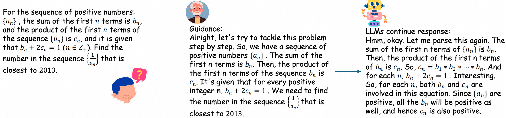

<h2 align="center"> <a href="https://arxiv.org/abs/2508.13023">G2RPO-A: Guided Group Relative Policy Optimization with Adaptive Guidance</a></h2>

<h3 align="center"> Yongxin Guo*, Wenbo Deng*, Zhenglin Cheng, Xiaoying Tang </h3>

<p align="center">
  If our project helps you, please give us a star ⭐ and cite our <a href="#bibliography">paper</a>!
</p>

<p align="center">
  <a href="https://arxiv.org/abs/2508.13023">
    
  </a>
  <a href="#bibliography">
    
  </a>
</p>

## News

- **[2026.05]** 🎉 Our paper is accepted to ACL 2026 Main Conference!
- 08.26.2025, Code is released.

## TODO

- [ ] Release the model checkpoints
- [ ] Release the inference and evaluation code
- [ ] Release the training data
- [x] Release the training code

## Overview

In this project, we
- Investigate Guided GRPO, and provide comprehensive study of various guidance configurations.
- Introduce G2RPO-A, an adaptive algorithm that automatically adjusts guidance length in response to the evolving training state.

## Why Do We Need G2RPO-A?

Guided GRPO can improve reasoning and code generation by injecting external guidance into policy optimization. However, the effectiveness of guidance strongly depends on how much guidance is provided at different stages of training.

G2RPO-A addresses this challenge with adaptive guidance. It automatically adjusts the guidance length according to the evolving training state, reducing manual tuning while preserving the benefits of guided optimization.

<div align="center">
    
    <br/>
    <figcaption>Guided GRPO</figcaption>
</div>

## Environments

## Model Zoo

## Data

## Training

G2RPO-A training
```
ACCELERATE_LOG_LEVEL=info \
accelerate launch \
    --config_file recipes/accelerate_configs/zero2.yaml \
    --num_processes=7 \
    src/open_r1/grpo_code_adagui.py \
    --config recipes/Qwen3-1.7B/grpo/qwen38code.yaml
```


## Inference and Evaluation

## Acknowledgement
We are grateful for the following awesome projects:

## Bibliography
If you find this project helpful, please consider citing our work:
```
@inproceedings{guo2026g2rpoa,
  title={G2RPO-A: Guided Group Relative Policy Optimization with Adaptive Guidance},
  author={Guo, Yongxin and Deng, Wenbo and Cheng, Zhenglin and Tang, Xiaoying},
  booktitle={Proceedings of the 64th Annual Meeting of the Association for Computational Linguistics (ACL 2026)},
  year={2026}
}
```

### Training script
```
ACCELERATE_LOG_LEVEL=info accelerate launch --config_file recipes/accelerate_configs/zero2.yaml --num_processes=7 src/open_r1/grpo_code_adagui.py --config recipes/Qwen3-1.7B/grpo/qwen38code.yaml
```
### Evaluation
