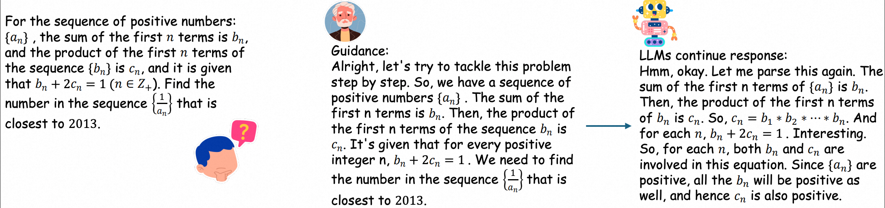

<h2 align="center"> <a href="https://arxiv.org/abs/2508.13023">G2RPO-A: Guided Group Relative Policy Optimization with Adaptive Guidance</a></h2>

<h3 align="center"> Yongxin Guo*, Wenbo Deng*, Zhenglin Cheng, Xiaoying Tang </h3>

<p align="center">
  If our project helps you, please give us a star ⭐ and cite our <a href="#bibliography">paper</a>!
</p>

<p align="center">
  <a href="https://arxiv.org/abs/2508.13023">
    
  </a>
  <a href="#bibliography">
    
  </a>
</p>

## News

- **[2026.05]** 🎉 Our paper is accepted to ACL 2026 Main Conference!
- 08.26.2025, Code is released.

## TODO

- [x] Release the model checkpoints
- [x] Release the inference and evaluation code
- [x] Release the training data
- [x] Release the training code

## Overview

In this project, we
- Investigate Guided GRPO, and provide comprehensive study of various guidance configurations.
- Introduce G2RPO-A, an adaptive algorithm that automatically adjusts guidance length in response to the evolving training state.

## Why Do We Need G2RPO-A?

Guided GRPO can improve reasoning and code generation by injecting external guidance into policy optimization. However, the effectiveness of guidance strongly depends on how much guidance is provided at different stages of training.

G2RPO-A addresses this challenge with adaptive guidance. It automatically adjusts the guidance length according to the evolving training state, reducing manual tuning while preserving the benefits of guided optimization.

<div align="center">
    
    <br/>
    <figcaption>Guided GRPO</figcaption>
</div>

## Environments

G²RPO-A builds on Open-R1 with a customized TRL GRPO trainer. Our recorded environment uses **TRL `0.15.2` and Transformers `4.52.3`**. These versions are particularly relevant when reproducing the Qwen3 experiments.

### Software and hardware

The original environment setup uses **Python 3.11** and **CUDA 12.4**. The paper reports training on **8 NVIDIA A100 GPUs**, and the provided recipes use BF16, DeepSpeed, vLLM, and FlashAttention 2.

The following installed versions are recorded in the package inventory archived with the supplementary materials (`opern1.txt`):

| Component | Version |
| --- | --- |
| TRL | **0.15.2** |
| Transformers | **4.52.3** |
| PyTorch | 2.5.1 |
| vLLM | 0.7.2 |
| Accelerate | 1.4.0 |
| DeepSpeed | 0.15.4 |
| FlashAttention | 2.7.4.post1 |
| Datasets | 3.6.0 |
| Math-Verify | 0.5.2 |
| Liger Kernel | 0.6.0 |
| SwanLab | 0.6.3 |

### TRL: use 0.15.2 with our custom trainer

The recorded training environment uses **`trl==0.15.2`**. The older Open-R1 dependency declaration contains a reference to Git commit `69ad852e5654a77f1695eb4c608906fe0c7e8624` (`0.16.0.dev0`); use the installed-package record above when reconstructing our environment.

G²RPO-A also requires our [custom GRPO trainer](src/G2RPO-A/trainer/g2rpoa_trainer.py), which implements adaptive guidance. This file defines `GRPOTrainer` and uses TRL-internal relative imports; it is intended to replace `trl/trainer/grpo_trainer.py` in the TRL installation. Installing the standard TRL package alone does not enable G²RPO-A. The [rule-based trainer](src/G2RPO-A/trainer/rule-based-decay.py) provides the alternative guidance-decay policy.

After preparing the dependencies, install the recorded TRL version explicitly:

```bash
python -m pip install --no-deps "trl==0.15.2"
```

`--no-deps` preserves the separately configured dependencies; this command only installs TRL.

### Transformers: Qwen3 requires a newer version

The original Open-R1 configuration pins **Transformers `4.49.0`**, which does not support Qwen3 out of the box. Qwen3 support was introduced in [Transformers `4.51.0`](https://github.com/huggingface/transformers/releases/tag/v4.51.0), and the [official Qwen3 model card](https://huggingface.co/Qwen/Qwen3-1.7B#quickstart) states that older versions raise `KeyError: 'qwen3'`.

For the recorded project environment, use **`transformers==4.52.3`**. Here, `4.51.0` is the minimum version for recognizing Qwen3, while **`4.52.3` is the version recorded in our environment**. Support for the model architecture alone does not establish compatibility with the entire training stack.

### Installation notes

The current [setup.py](setup.py) still contains older Transformers and Liger Kernel pins, and its TRL dependency is commented out. Those declarations need to be reconciled with the versions above when recreating the environment; installing the repository alone does not reproduce the recorded environment. A fresh installation and GPU training run have not yet been validated for the current repository layout.

## Model Zoo

The following model checkpoint is publicly available on Hugging Face.

| Model | Backbone | Task | Download |
| --- | --- | --- | --- |
| Qwen3-1.7B-Math | Qwen3-1.7B | Mathematical reasoning | [Hugging Face](https://huggingface.co/G2RPO-A/Qwen3-1.7B-Math) |

## Data

- **[Math-Curriculum-1K](https://huggingface.co/datasets/G2RPO-A/Math-Curriculum-1K)**: 1,000 mathematical reasoning training examples with verified reasoning trajectories, organized into five source-based curriculum tiers from easy to hard. See the dataset card for construction details, field descriptions, and loading instructions.
- **[Code-CoT](https://huggingface.co/datasets/G2RPO-A/Code-CoT)**: 1,086 Python programming problems with reasoning trajectories generated by QwQ-32B-Preview and executable test cases, curated from Open-R1 Verifiable Coding Problems Python for guided reinforcement learning. See the dataset card for construction details, source composition, and loading instructions.

## Training

G2RPO-A training
```
ACCELERATE_LOG_LEVEL=info \
accelerate launch \
    --config_file recipes/accelerate_configs/zero2.yaml \
    --num_processes=7 \
    src/open_r1/grpo_code_adagui.py \
    --config recipes/Qwen3-1.7B/grpo/qwen38code.yaml
```


## Inference and Evaluation

### MATH-500 with EvalScope

Use the following [EvalScope](https://github.com/modelscope/evalscope) command as an evaluation example. Replace `/path/to/checkpoint` with your model checkpoint directory.

```bash
evalscope eval \
  --model /path/to/checkpoint \
  --datasets math_500 \
  --dataset-args '{"math_500": {"few_shot_num": 0}}' \
  --eval-batch-size 128 \
  --generation-config '{"max_tokens":25000,"temperature":0.6,"top_p":0.95,"top_k":20,"n":1}' \
  --timeout 60000 \
  --stream \
  --limit 102
```

This example uses zero-shot evaluation and limits the run to **102 examples**. Remove `--limit 102` to evaluate the full MATH-500 dataset. The generation settings use a maximum of 25,000 tokens, temperature 0.6, top-p 0.95, and top-k 20.

## Acknowledgement

We thank the developers and contributors of the following open-source projects and datasets:

- **Training framework:** [Open-R1](https://github.com/huggingface/open-r1), which provides the foundation for our implementation.
- **Training datasets:** [OpenR1-Math-220k](https://huggingface.co/datasets/open-r1/OpenR1-Math-220k), [Verifiable Coding Problems Python](https://huggingface.co/datasets/open-r1/verifiable-coding-problems-python), and [s1K-1.1](https://huggingface.co/datasets/simplescaling/s1K-1.1), which support our mathematical reasoning, code generation, and guidance experiments.
- **Evaluation benchmarks:** [MATH-500](https://huggingface.co/datasets/HuggingFaceH4/MATH-500), [Minerva-Math](https://github.com/EleutherAI/lm-evaluation-harness/tree/main/lm_eval/tasks/minerva_math), [GPQA](https://github.com/idavidrein/gpqa), [AIME24](https://huggingface.co/datasets/HuggingFaceH4/aime_2024), [AIME25](https://huggingface.co/datasets/yentinglin/aime_2025), [HumanEval](https://github.com/openai/human-eval), and [LiveCodeBench](https://github.com/LiveCodeBench/LiveCodeBench).
- **Evaluation tools:** [EvalScope](https://github.com/modelscope/evalscope) from the ModelScope community, [LightEval](https://github.com/huggingface/lighteval), and [LM Evaluation Harness](https://github.com/EleutherAI/lm-evaluation-harness).
- **Answer verification and code execution:** [Math-Verify](https://github.com/huggingface/Math-Verify) and [E2B](https://github.com/e2b-dev/E2B).

## Bibliography
If you find this project helpful, please consider citing our work:
```
@inproceedings{guo2026g2rpoa,
  title={G2RPO-A: Guided Group Relative Policy Optimization with Adaptive Guidance},
  author={Guo, Yongxin and Deng, Wenbo and Cheng, Zhenglin and Tang, Xiaoying},
  booktitle={Proceedings of the 64th Annual Meeting of the Association for Computational Linguistics (ACL 2026)},
  year={2026}
}
```

### Training script
```
ACCELERATE_LOG_LEVEL=info accelerate launch --config_file recipes/accelerate_configs/zero2.yaml --num_processes=7 src/open_r1/grpo_code_adagui.py --config recipes/Qwen3-1.7B/grpo/qwen38code.yaml
```
### Evaluation
