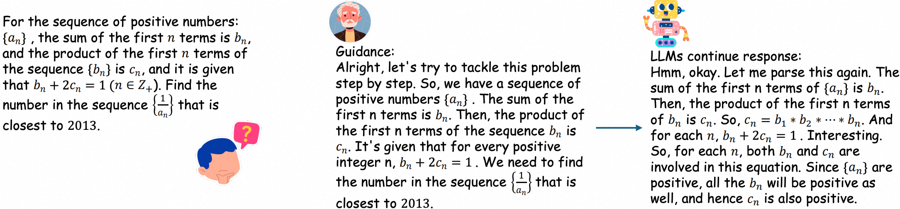

<h2 align="center"> <a href="https://arxiv.org/abs/2508.13023">G2RPO-A: Guided Group Relative Policy Optimization with Adaptive Guidance</a></h2>

<h3 align="center"> Yongxin Guo*, Wenbo Deng*, Zhenglin Cheng, Xiaoying Tang </h3>

<h5 align="center"> If our project helps you, please give us a star ⭐ and cite our <a href="#bibliography">paper</a>!</h2>
<h5 align="center">

## News

- 08.26.2025, Code is released.

## TODO

- [ ] Release the model checkpoints
- [ ] Release the inference and evaluation code
- [ ] Release the training data
- [x] Release the training code

## Overview

In this project, we
- Investigate Guided GRPO, and provide comprehensive study of various guidance configurations.
- Introduce G2RPO-A, an adaptive algorithm that automatically adjusts guidance length in response to the evolving training state.

<div align="center">
    
    <br/>
    <figcaption>Guided GRPO</figcaption>
</div>

## Environments

## Model Zoo

## Data

## Training

G2RPO-A training
```
python ./src/grpo.py
```


## Inference and Evaluation

## Acknowledgement
We are grateful for the following awesome projects:

## Bibliography
If you find this repository helpful for your project, please consider citing:
```
@article{guo2025g,
  title={G $\^{} 2$ RPO-A: Guided Group Relative Policy Optimization with Adaptive Guidance},
  author={Guo, Yongxin and Deng, Wenbo and Cheng, Zhenglin and Tang, Xiaoying},
  journal={arXiv preprint arXiv:2508.13023},
  year={2025}
}
```

